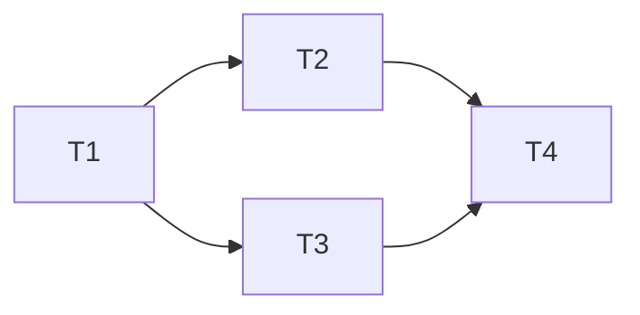

# <计划标题>

状态：Draft
范围：<包含的模块、目录或行为>
非目标：<明确不做的内容>

## 成功标准

- [ ] <可观察结果>

## 已知事实与未知项

- 事实：<证据、文件或运行行为>
- 待确认：<阻塞项；没有则写“无”>

## 任务清单

### T1 <任务名>

- 目标：<目标>
- 范围：<模块或行为边界>
- depends_on：无
- owned_paths：`<path>`
- 执行者：`main | subagent:explore | subagent:generalPurpose`
- 产出：<可审阅产物>
- 验收：<命令、检查或行为>
- 并行限制：<共享状态或互斥项；没有则写“无”>

## 依赖图

## 执行波次

### Wave 1 — <名称>（parallel | sequential）

准入条件：无。

- `T1`：<任务名>
- `T3`：<任务名>

完成门：

- [ ] T1 验收通过。
- [ ] T3 验收通过。

失败策略：任一必需任务失败则 Wave blocked；保留已完成任务，只修复或恢复失败任务。

### Wave 2 — <名称>（parallel | sequential）

准入条件：Wave 1 完成门通过。

- `T2`：<任务名>

完成门：

- [ ] <可观察条件>

失败策略：<策略>

## 执行约束

- 只执行最早未完成 Wave。
- 简单、共享文件或强耦合任务由主线执行。
- 同波 Subagent 仅在范围互不重叠时并行，最多 4 个。
- 收齐同波结果并更新 Todo 后才能检查完成门。
- 未通过完成门不得进入下一 Wave。

## 最终完成条件

- [ ] 每个任务验收通过。
- [ ] 每个 Wave 完成门通过。
- [ ] 无未说明的兼容性、迁移或发布风险。